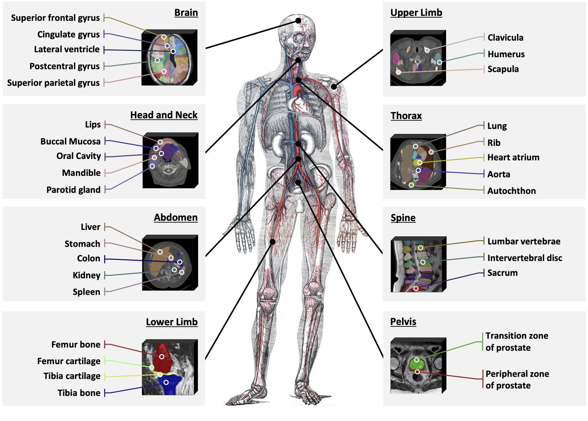

# SAT-DS

This is the official repository to build **SAT-DS**, a medical data collection of **72** public segmentation datasets, contains over **22K** 3D images, **302K** segmentation masks and **497** classes from **3** different modalities (MRI, CT, PET) and **8** human body regions. 🚀

This repo can be used to prepare and unfied all these datasets to train [SAT](https://github.com/zhaoziheng/SAT), or any 3D universal medical segmentation model driven by text prompts.

Check our paper "One Model to Rule them All: Towards Universal Segmentation for Medical Images with Text Prompts" for more details.

[ArXiv](https://arxiv.org/abs/2312.17183)

[Website](https://zhaoziheng.github.io/SAT/)



# Step 1: Download datasets
This is the detailed list of all the datasets and their download links.
| Dataset Name              | Modality | Region        | Classes | Scans | Download link                                                                                      |
|---------------------------|----------|---------------|---------|-------|----------------------------------------------------------------------------------------------------|
| AbdomenCT1K               | CT       | Abdomen       | 4       | 988   | https://github.com/JunMa11/AbdomenCT-1K                                                            |
| ACDC                      | CT       | Thorax        | 4       | 300   | https://humanheart-project.creatis.insa-lyon.fr/database/                                          |
| AMOS CT                   | CT       | Abdomen       | 16      | 300   | https://zenodo.org/records/7262581                                                                 |
| AMOS MRI                  | MRI      | Thorax        | 16      | 60    | https://zenodo.org/records/7262581                                                                 |
| ATLASR2                   | MRI      | Brain         | 1       | 654   | http://fcon_1000.projects.nitrc.org/indi/retro/atlas.html                                          |
| ATLAS                     | MRI      | Abdomen       | 2       | 60    | https://atlas-challenge.u-bourgogne.fr                                                             |
| autoPET                   | PET      | Whole Body    | 1       | 501   | https://wiki.cancerimagingarchive.net/pages/viewpage.action?pageId=93258287                        |
| Brain Atlas               | MRI      | Brain         | 108     | 30    | http://brain-development.org/                                                                      |
| BrainPTM                  | MRI      | Brain         | 7       | 60    | https://brainptm-2021.grand-challenge.org/                                                         |
| BraTS2023 GLI             | MRI      | Brain         | 4       | 5004  | https://www.synapse.org/#!Synapse:syn51514105                                                      |
| BraTS2023 MEN             | MRI      | Brain         | 4       | 4000  | https://www.synapse.org/#!Synapse:syn51514106                                                      |
| BraTS2023 MET             | MRI      | Brain         | 4       | 951   | https://www.synapse.org/#!Synapse:syn51514107                                                      |
| BraTS2023 PED             | MRI      | Brain         | 4       | 396   | https://www.synapse.org/#!Synapse:syn51514108                                                      |
| BraTS2023 SSA             | MRI      | Brain         | 4       | 240   | https://www.synapse.org/#!Synapse:syn51514109                                                      |
| BTCV Abdomen              | CT       | Abdomen       | 15      | 30    | https://www.synapse.org/#!Synapse:syn3193805/wiki/217789                                           |
| BTCV Cervix               | CT       | Abdomen       | 4       | 30    | https://www.synapse.org/Synapse:syn3378972                                                         |
| CHAOS CT                  | CT       | Abdomen       | 1       | 20    | https://chaos.grand-challenge.org/                                                                 |
| CHAOS MRI                 | MRI      | Abdomen       | 5       | 60    | https://chaos.grand-challenge.org/                                                                 |
| CMRxMotion                | MRI      | Thorax        | 4       | 138   | https://www.synapse.org/#!Synapse:syn28503327/files/                                               |
| Couinaud                  | CT       | Abdomen       | 10      | 161   | https://github.com/GLCUnet/dataset                                                                 |
| COVID-19 CT Seg           | CT       | Thorax        | 4       | 20    | https://github.com/JunMa11/COVID-19-CT-Seg-Benchmark                                               |
| CrossMoDA2021             | MRI      | Head and Neck | 2       | 105   | https://crossmoda.grand-challenge.org/Data/                                                        |
| CT-ORG                    | CT       | Whole Body    | 6       | 140   | https://wiki.cancerimagingarchive.net/pages/viewpage.action?pageId=61080890                        |
| CTPelvic1K                | CT       | Lower Limb    | 5       | 117   | https://zenodo.org/record/4588403#.YEyLq_0zaCo                                                     |
| DAP Atlas                 | CT       | Whole Body    | 179     | 533   | https://github.com/alexanderjaus/AtlasDataset                                                      |
| FeTA2022                  | MRI      | Brain         | 7       | 80    | https://feta.grand-challenge.org/data-download/                                                    |
| FLARE22                   | CT       | Abdomen       | 15      | 50    | https://flare22.grand-challenge.org/                                                               |
| FUMPE                     | CT       | Thorax        | 1       | 35    | https://www.kaggle.com/datasets/andrewmvd/pulmonary-embolism-in-ct-images                          |
| HAN Seg                   | CT       | Head and Neck | 41      | 41    | https://zenodo.org/record/                                                                         |
| HECKTOR2022               | PET      | Head and Neck | 2       | 524   | https://hecktor.grand-challenge.org/Data/                                                          |
| INSTANCE                  | CT       | Brain         | 1       | 100   | https://instance.grand-challenge.org/Dataset/                                                      |
| ISLES2022                 | MRI      | Brain         | 1       | 500   | http://www.isles-challenge.org/                                                                    |
| KiPA22                    | CT       | Abdomen       | 4       | 70    | https://kipa22.grand-challenge.org/dataset/                                                        |
| KiTS23                    | CT       | Abdomen       | 3       | 489   | https://github.com/neheller/kits23                                                                 |
| LAScarQS2022 Task 1       | MRI      | Thorax        | 2       | 60    | https://zmiclab.github.io/projects/lascarqs22/data.html                                            |
| LAScarQS2022 Task 2       | MRI      | Thorax        | 1       | 130   | https://zmiclab.github.io/projects/lascarqs22/data.html                                            |
| LNDb                      | CT       | Thorax        | 1       | 236   | https://zenodo.org/record/7153205#.Yz_oVHbMJPZ                                                     |
| LUNA16                    | CT       | Thorax        | 1       | 888   | https://luna16.grand-challenge.org/                                                                |
| MM-WHS CT                 | CT       | Thorax        | 9       | 40    | https://mega.nz/folder/UNMF2YYI#1cqJVzo4p_wESv9P_pc8uA                                             |
| MM-WHS MR                 | MRI      | Thorax        | 9       | 40    | https://mega.nz/folder/UNMF2YYI#1cqJVzo4p_wESv9P_pc8uA                                             |
| MRSpineSeg                | MRI      | Spine         | 23      | 91    | https://www.cg.informatik.uni-siegen.de/en/spine-segmentation-and-analysis                         |
| MSD Cardiac               | MRI      | Thorax        | 1       | 20    | http://medicaldecathlon.com/                                                                       |
| MSD Colon                 | CT       | Abdomen       | 1       | 126   | http://medicaldecathlon.com/                                                                       |
| MSD HepaticVessel         | CT       | Abdomen       | 2       | 303   | http://medicaldecathlon.com/                                                                       |
| MSD Hippocampus           | MRI      | Brain         | 3       | 260   | http://medicaldecathlon.com/                                                                       |
| MSD Liver                 | CT       | Abdomen       | 2       | 131   | http://medicaldecathlon.com/                                                                       |
| MSD Lung                  | CT       | Thorax        | 1       | 63    | http://medicaldecathlon.com/                                                                       |
| MSD Pancreas              | CT       | Abdomen       | 2       | 281   | http://medicaldecathlon.com/                                                                       |
| MSD Prostate              | MRI      | Pelvis        | 2       | 64    | http://medicaldecathlon.com/                                                                       |
| MSD Spleen                | CT       | Abdomen       | 1       | 41    | http://medicaldecathlon.com/                                                                       |
| MyoPS2020                 | MRI      | Thorax        | 6       | 135   | https://mega.nz/folder/BRdnDISQ#FnCg9ykPlTWYe5hrRZxi-w                                             |
| NSCLC                     | CT       | Thorax        | 2       | 85    | https://wiki.cancerimagingarchive.net/pages/viewpage.action?pageId=68551327                        |
| Pancreas CT               | CT       | Abdomen       | 1       | 80    | https://wiki.cancerimagingarchive.net/display/public/pancreas-ct                                   |
| Parse2022                 | CT       | Thorax        | 1       | 100   | https://parse2022.grand-challenge.org/Dataset/                                                     |
| PDDCA                     | CT       | Head and Neck | 12      | 48    | https://www.imagenglab.com/newsite/pddca/                                                          |
| PROMISE12                 | MRI      | Pelvis        | 1       | 50    | https://promise12.grand-challenge.org/Details/                                                     |
| SEGA                      | CT       | Whole Body    | 1       | 56    | https://multicenteraorta.grand-challenge.org/data/                                                 |
| SegRap2023 Task1          | CT       | Head and Neck | 61      | 120   | https://segrap2023.grand-challenge.org/                                                            |
| SegRap2023 Task2          | CT       | Thorax        | 2       | 120   | https://segrap2023.grand-challenge.org/                                                            |
| SegTHOR                   | CT       | Thorax        | 4       | 40    | https://competitions.codalab.org/competitions/21145#learn_the_details                              |
| SKI10                     | CT       | Upper Limb    | 4       | 99    | https://ambellan.de/sharing/QjrntLwah                                                              |
| SLIVER07                  | CT       | Abdomen       | 1       | 20    | https://sliver07.grand-challenge.org/                                                              |
| ToothFairy                | MRI      | Head and Neck | 4       | 153   | https://ditto.ing.unimore.it/toothfairy/                                                           |
| TotalSegmentator Cardiac  | CT       | Whole Body    | 17      | 1202  | https://zenodo.org/record/6802614                                                                  |
| TotalSegmentator Muscles  | CT       | Whole Body    | 31      | 1202  | https://zenodo.org/record/6802614                                                                  |
| TotalSegmentator Organs   | CT       | Whole Body    | 24      | 1202  | https://zenodo.org/record/6802614                                                                  |
| TotalSegmentator Ribs     | CT       | Whole Body    | 39      | 1202  | https://zenodo.org/record/6802614                                                                  |
| TotalSegmentator Vertebrae| CT       | Whole Body    | 29      | 1202  | https://zenodo.org/record/6802614                                                                  |
| TotalSegmentator V2       | CT       | Whole Body    | 24      | 1202  | https://zenodo.org/record/6802614                                                                  |
| VerSe                     | CT       | Whole Body    | 29      | 96    | https://github.com/anjany/verse                                                                    |
| WMH                       | MRI      | Brain         | 1       | 170   | https://wmh.isi.uu.nl/                                                                             |
| WORD                      | CT       | Abdomen       | 18      | 150   | https://github.com/HiLab-git/WORD                                                                  |

# Step 2: Preprocess datasets
For each dataset, we need to find all the image and mask pairs, and another 5 basic information: dataset name, modality, label name, patient ids (to split train-test set) and official split (if provided). \
In `processor.py`, we customize the process procedure for each dataset, to generate a jsonl file including these information for each sample. \
Take AbdomenCT1K for instance, you need to run the following command:
```
python processor.py --dataset_name AbdomenCT1K --root_path 'SAT-DS/datasets/AbdomenCT-1K' --jsonl_dir 'SAT-DS/jsonl_files'
```
`root_path` should be where you download and place the data, `jsonl_dir` should be where you plan to place the jsonl files. \
⚠️ Note the `dataset_name` and the name in the table might not be exactly the same. For specific details, please refer to each process function in `processor.py`. \
After process, each sample in jsonl files would be like:
```
{
  'image' :"SAT-DS/datasets/AbdomenCT-1K/Images/Case_00558_0000.nii.gz",
  'mask': "SAT-DS/datasets/AbdomenCT-1K/Masks/Case_00558.nii.gz",
  'label': ["liver", "kidney", "spleen", "pancreas"],
  'modality': 'CT',
  'dataset': 'AbdomenCT1K,
  'official_split': 'unknown',
  'patient_id': 'Case_00558_0000.nii.gz',
}
```
Note that in this step, we may convert the image and mask into new nifiti files for some datasets, such as TotalSegmentator and so on. So it may take some time.

# Step 3: Load data with unified normalization
With the generated jsonl file, a dataset is now ready to be used. \
However, when mixing all the datasets to train a universal segmentation model, we need to apply normalization on the image intensity, orientation, spacing across all the datasets, and adjust labels if necessary. \
We realize this by customizing the load script for each dataset in `loader.py`, this is a simple demo how to use it:
```
from loader import Loader_Wrapper

loader = Loader_Wrapper()
    
# load samples from jsonl
with open('SAT-DS/jsonl_files', 'r') as f:
    lines = f.readlines()
    data = [json.loads(line) for line in lines]

# load a sample
for sample in data:
    batch = getattr(loader, func_name)(sample)
    img_tensor, mc_mask, text_ls, modality, image_path, mask_path = batch
```
For each sample, the loader will output:
```
img_tensor  # tensor with shape (1, H, W, D)
mc_mask  # binary tensor with shape (N, H, W, D), one channel for each class;
text_ls  # a list of N class name;
modality  # MRI, CT or PET;
image_path  # path to mask file;
mask_path  # path to imag file;
```
We also offer the shortcut to visualize and check any sample in any dataset after normalization. For example, to visualize the first sample in AbdomenCT1K, just run the following command:
```
python loader.py --visualization_dir 'SAT-DS/visualization' --path2jsonl 'SAT-DS/jsonl_files/AbdomenCT1K.jsonl' --i 0
```

# (Optional) Step 4: Split train and test set
We offer the train-test split used in our paper for each dataset in json files. To follow our split and benchmark your method, simply run this command:
```
python train_test_split.py --jsonl2split 'SAT-DS/jsonl_files/AbdomenCT1K.jsonl' --train_jsonl 'SAT-DS/trainsets/AbdomenCT1K.jsonl' --test_jsonl 'SAT-DS/testsets/AbdomenCT1K.jsonl' --split_json 'split_json/AbdomenCT1K'
```
This will split the jsonl file into train and test.
